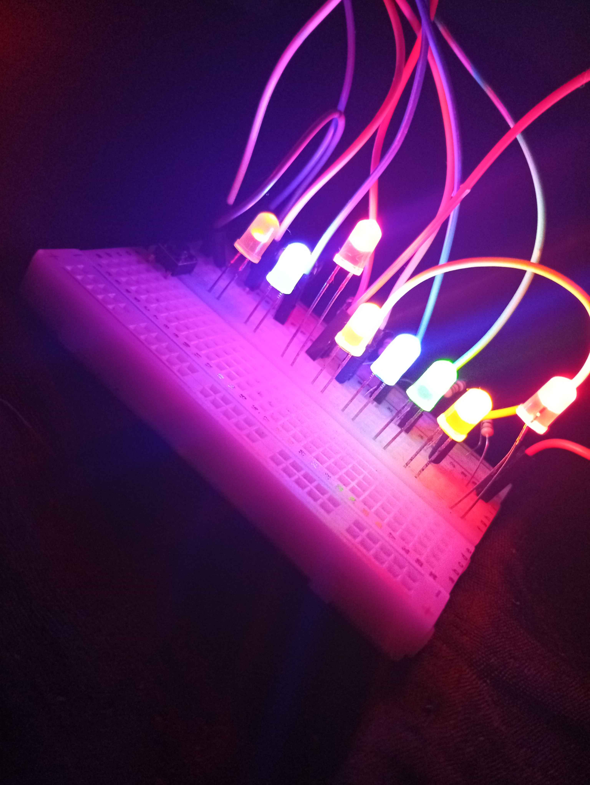

# 💡 Controle de LEDs com Modos de Iluminação

## 📖 Descrição

Projeto desenvolvido com Arduino para controlar diferentes grupos de LEDs utilizando um botão.

Cada pressionamento do botão alterna entre diferentes modos de iluminação.

## ⚙️ Funcionalidades

- Modo 0: Todos os LEDs com efeito Fade.
- Modo 1: Apenas LEDs amarelos.
- Modo 2: Apenas LEDs azuis.
- Modo 3: Apenas LED vermelho.
- Modo 4: Apenas LED verde.

## 🧰 Componentes Utilizados

- Arduino Uno
- 6 a 8 LEDs
- Resistores
- Botão
- Protoboard
- Jumpers

## 🧠 Conceitos Aplicados

- Arrays
- Loops `for`
- PWM
- Função seno (`sin`)
- Máquina de estados
- Controle de entrada por botão

## 🔌 Esquema do Circuito

## 💻 Código

O código principal do projeto está disponível no arquivo `.ino` deste repositório.

## 🚀 Melhorias Futuras

- Adicionar sensores de movimento.
- Adicionar sensor de temperatura.
- Implementar novos modos de iluminação.
- Utilizar display para exibir o modo atual.

## 📚 Aprendizados

Durante este projeto foram praticados os seguintes conceitos:

- Organização de LEDs utilizando arrays.
- Utilização de PWM para controle de brilho.
- Criação de efeitos Fade utilizando a função seno.
- Implementação de uma máquina de estados simples.
- Controle de múltiplos modos através de um botão.

## 👨‍💻 Autor

**Arthur Miguel Rodrigues da Silva**

GitHub: https://github.com/ArthurTechLab
